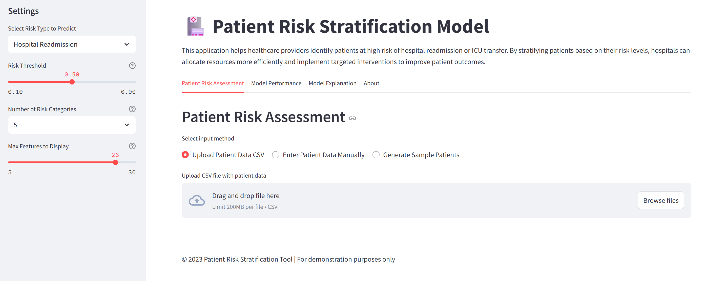
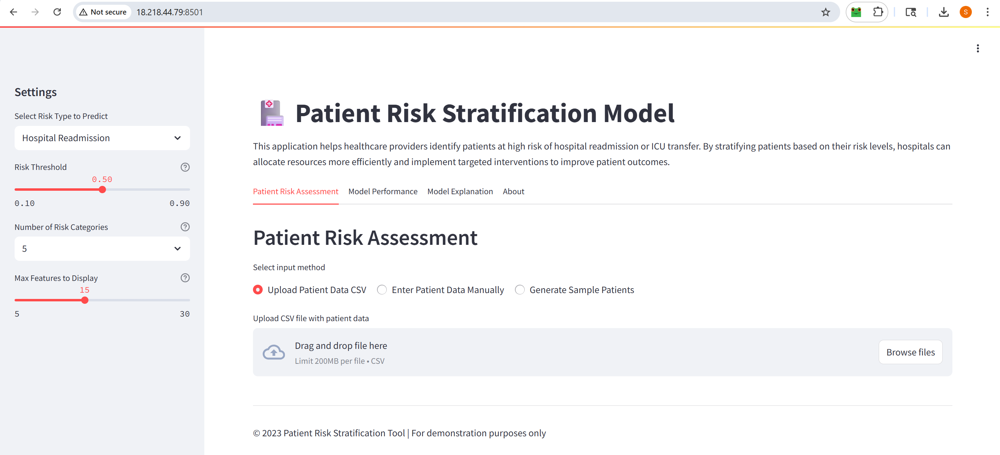

# Patient Risk Stratification Model

A machine learning-based clinical decision support tool that predicts patient readmission risk and ICU transfer risk using electronic health record data. This application helps healthcare providers identify high-risk patients, prioritize care, and optimize resource allocation.



## Features

- **Risk Prediction**: Predict patient readmission risk or ICU transfer risk
- **Risk Stratification**: Categorize patients into risk levels for targeted interventions
- **Interactive Dashboard**: User-friendly interface for clinical decision support
- **Model Explainability**: Interpret model predictions to understand risk factors
- **Batch Processing**: Analyze multiple patients simultaneously
- **Performance Metrics**: Visualize model accuracy and other key metrics

## Application Demo

The application is deployed at: [Streamlit Cloud_patient-risk-stratification-model](https://patient-risk-stratification-model.streamlit.app/)

## Installation (Local)

1. Clone the repository:
    ```bash
    git clone https://github.com/your-username/patient-risk-stratification.git
    cd patient-risk-stratification
    ```

2. Create a virtual environment:
    ```bash
    python -m venv venv
    source venv/bin/activate  # On Windows: venv\Scripts\activate
    ```

3. Install dependencies:
    ```bash
    pip install -r requirements.txt
    ```

4. Run the application:
    ```bash
    streamlit run app.py
    ```

5. Access the app at: `http://localhost:8501`

---

## 🚀 Deployment Options

This application can be deployed using either **Streamlit Cloud** for quick testing or **AWS EC2 with Docker** for a production-ready deployment.

---

### 📌 1. Deployment on Streamlit Cloud

1. **Upload Code to GitHub**
    - Make sure your repository contains all necessary files:
      - `app.py`
      - `requirements.txt`
      - Any data files (if required).

2. **Sign in to Streamlit Cloud**
    - Go to [https://streamlit.io/cloud](https://streamlit.io/cloud) and sign in using your GitHub account.

3. **Deploy the App**
    - Click on **"New app"**.
    - Connect your GitHub repository.
    - Choose the `main` branch and select `app.py` as the main file.
    - Click **"Deploy"**.

4. **Access the App**
    - Streamlit will provide a URL like:  
      `https://yourusername-yourrepo.streamlit.app`
    - The app is publicly accessible over HTTPS.

---

### 📌 2. Deployment on AWS EC2 with Docker

Deploy the application on an EC2 instance using Docker for better control, scalability, and potential HTTPS configuration.

#### Steps:

1. **Provision EC2 Instance**
    - Launch an EC2 instance (Ubuntu 20.04 recommended).
    - Choose appropriate instance type (e.g., t2.micro for testing, t3.medium for production).
    - Configure the security group to allow inbound traffic on port 8501 (Streamlit).

2. **Upload Project Files**
    - From your local machine, use `scp` to upload your zipped project folder:
      ```bash
      scp -i "path/to/your-key.pem" patient_model.zip ubuntu@<EC2-Public-IP>:/home/ubuntu/
      ```
    - SSH into the instance:
      ```bash
      ssh -i "path/to/your-key.pem" ubuntu@<EC2-Public-IP>
      ```
    - Unzip the project:
      ```bash
      unzip patient_model.zip
      cd "Patient risk stratification model"
      ```

3. **Build Docker Image**
    - Ensure Docker is installed on the EC2 instance.
    - Build the Docker image:
      ```bash
      sudo docker build -t patient-risk-app .
      ```

4. **Run Docker Container**
    - Run the container:
      ```bash
      sudo docker run -d -p 8501:8501 patient-risk-app
      ```
    - Access the app at:
      ```
      http://<EC2-Public-IP>:8501
      ```

5. **Snapshot**
    - 

#### Notes:
- Docker ensures consistent environments, easy versioning, and containerized deployment.
- For production, consider:
  - HTTPS termination using a reverse proxy (e.g., Nginx).
  - Configuring a custom domain with SSL.
  - Auto-scaling via ECS/EKS for high availability.

---

## Project Structure

patient_risk_stratification/
├── data/ # Raw and processed data
├── models/ # Saved model files
├── src/ # Source code
│ ├── init.py
│ ├── data_preprocessing.py # Data cleaning and feature engineering
│ ├── model_training.py # Model development and evaluation
│ └── utils.py # Helper functions
├── app.py # Streamlit application
├── requirements.txt # Dependencies
└── README.md # Project documentation

## Model Details

- **Algorithms**: XGBoost, Random Forest, Logistic Regression
- **Features**: Demographic information, vital signs, diagnoses, procedures, medications, lab results
- **Target Variables**: Hospital readmission risk, ICU transfer risk
- **Performance**: Evaluated using accuracy, precision, recall, F1-score, and ROC AUC

## Development

This project was developed as a portfolio project for a data science role in healthcare. The key steps in the development process were:

1. **Data Collection**: Utilizing open-source healthcare datasets for model training
2. **Exploratory Data Analysis**: Understanding the characteristics and patterns in patient data
3. **Feature Engineering**: Creating relevant features for risk prediction
4. **Model Development**: Training and evaluating different machine learning algorithms
5. **Application Development**: Building an interactive web application using Streamlit
6. **Model Interpretation**: Implementing SHAP for model explainability

## Future Improvements

- Implement a time-series analysis component for longitudinal patient data
- Add support for more risk prediction targets (e.g., mortality, length of stay)
- Integrate with external EHR systems for real-time data access
- Develop a clinical validation framework for model verification
- Add collaborative filtering for treatment recommendations

## Contact

- GitHub: https://github.com/SubhashG05
- LinkedIn: https://www.linkedin.com/in/g-subhash/
- Email: subhashg5397@gmail.com
